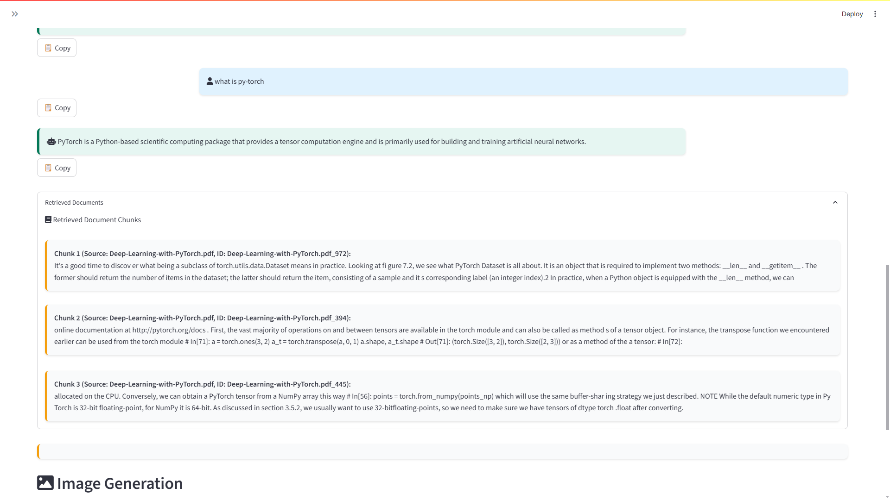

# 🧠 RAGvisor

**RAGvisor** is a user-friendly, Streamlit-powered application that brings **Retrieval-Augmented Generation (RAG)** to your documents and web content. Ask natural language questions and receive AI-powered answers grounded in your PDFs or scraped website content — complete with source citations and even AI-generated images.

---

##  Features

-  **PDF & Website Ingestion**  
  Upload documents or scrape websites. RAGvisor breaks them into semantic chunks using Sentence Transformers.

-  **Semantic Search + QA**  
  Ask natural language questions. The system retrieves relevant context via ChromaDB and responds using Groq's Mixtral LLM.

-  **AI Image Generation**  
  Use prompts to create visuals powered by DeepAI's text-to-image API.

-  **RAG Architecture**  
  Combines embeddings + context retrieval + fast generation from Groq’s LLM.

-  **Modular Backend**  
  Organized Python modules for easy extension and maintenance.

---

##  Tech Stack

| Component       | Technology                        |
|----------------|-----------------------------------|
| Framework       | Streamlit                         |
| LLM             | Mixtral-8x7B via Groq API         |
| Embedding Model | SentenceTransformers (`MiniLM`)  |
| Vector Store    | ChromaDB (PersistentClient)       |
| Image Generator | DeepAI API                        |
| Scraping        | BeautifulSoup + Requests          |

---

##  Demo Preview


### 🔎 Deep Dive Example

Here’s an example of a question-answer interaction with RAGvisor:




---

## 🔧 Installation

```bash
git clone https://github.com/TheharshVardhan01/RAGvisor.git
cd RAGvisor
pip install -r requirements.txt
